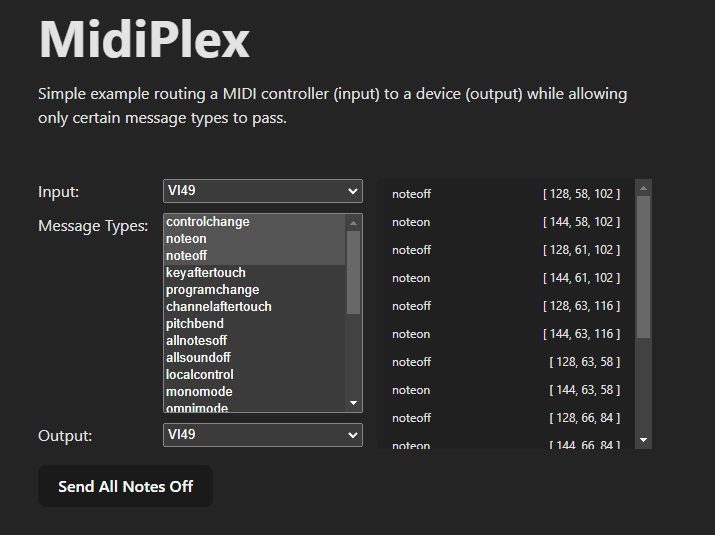

# midiplex

Midiplex is a realtime MIDI message filtering, routing, and mapping library built on top of [WebMidi.js](https://github.com/djipco/webmidi). Here are some example use cases:
 - Mapping "controlchange" messages between devices
 - Fine-tune the types of messages a controller can send to another device
 - Debugging MIDI messages
 - Writing custom MIDI filters
 - Augmenting or supplementing device behavior
 - Creative uses such as note randomizing or "chording" notes

[Demo](https://w9wnls-5173.csb.app/) - Simple UI demonstrating the ability to filter message types between a controller and device. \
[CodeSandbox](https://codesandbox.io/p/devbox/midiplex-w9wnls?file=%2Fsrc%2FApp.vue%3A77%2C25) - CodeSandbox for above demo. \
[Basic Example](#basic-example) \
[Motivation](#motivation)



## Basic Example

In this example we build a simple graph, connecting an input device to a message type pass node, which will only allow message types through as you specify, to an output device.

```typescript
import { WebMidi, Nodes } from 'midiplex';

(async () => {
    try {
        await WebMidi.enable();

        // Use these to get available ports, see WebMidi.js docs for more info 
        WebMidi.inputs;
        WebMidi.outputs;

        // Define our nodes
        let input = new Nodes.InputNode("<input id>");
        let output = new Nodes.OutputNode("<output id>");
        let messagePass = new Nodes.MessageTypePassNode("pass", {
            props: {
                messageTypes: ['noteon', 'noteoff']
            }
        });

        // Each node has a number of "edges" which we use to route messages
        // Many nodes will only have an "in" and "out" edge
        // Input --> Message Type Pass --> Output
        input.connect("out", messagePass.getInputEdge("in"));
        messagePass.connect("out", output.getInputEdge("in"));

    } catch (error){
        // Probably webmidi permissions not granted
    }
})()
```

This would be useful, for instance, if you wanted to map the keyboard portion of a controller to one device (`noteon`, `noteoff` messages), but the controls (switches, knobs, etc.) to a different device (`controlchange` messages). You could add further nodes, such as the `CCMapNode`, to map each CC message to it's counterpart on the target device.

## Motivation

This project began with a singular purpose - adding a "note latch mode" to the horrible, awful, terrible [Behringer FCB1010](https://www.behringer.com/product.html?modelCode=P0089) foot controller. Really, this controller is intended to be a digital FX or preset switcher, but I had the misguided idea of using it to control a [bass synth](https://www.korg.com/us/products/dj/volca_bass/) more akin to an [organ-style controller](https://www.sweetwater.com/store/detail/MP113--studiologic-mp-113-midi-pedal-controller), something I had witnessed both [Beach House](https://equipboard.com/pros/alex-scally) and [Nils Frahm](https://equipboard.com/pros/nils-frahm) do live. Sadly, the FCB1010 lacks the ability to "latch" onto a note, meaning that as soon as you lift your foot off a switch, your note stops playing (depending on your sustain, etc). This makes it considerably more difficult to work with, especially when standing an holding a guitar.

Latching could also occur on the controlled device, in this case a [Korg Volca Bass](https://www.korg.com/us/products/dj/volca_bass/), but the thing about cheap gear is that it tends to have only enough features to keep it from actually being useful. Anyways, I wrote a small script to bridge this gap and it worked quite well and eventually evolved into a more general solution, this library.

The `MonoLatchNode` provides the behavior described above. This node, when placed between a controller and a device, creates a sort of "quasi-mono mode" where only a single note can be active at a time. This node caches `noteoff` messages and only sends them once a new note is sent or the current note is sent again, which is how you exit the latch mode.